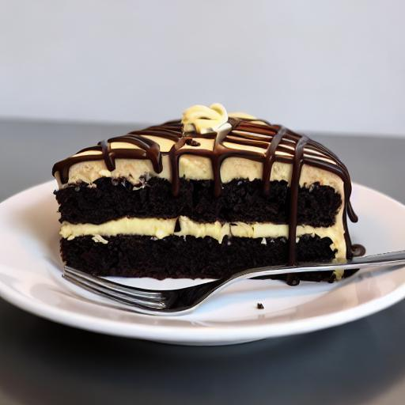
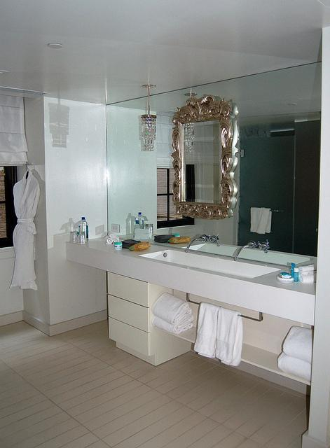
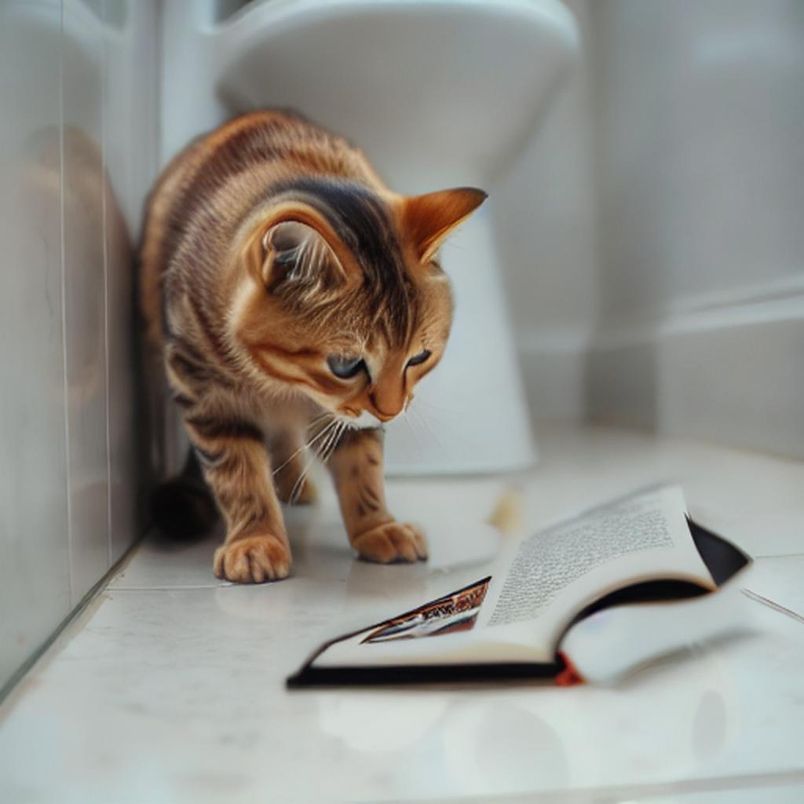

# AnyEdit
Mastering Unified High-Quality Image Editing for Any Idea
# 🌍 Introduction
AnyEdit is a comprehensive multimodal instruction editing dataset, comprising 2.5 million high-quality editing pairs spanning over 20 editing types across five domains. We ensure the diversity and quality of the AnyEdit collection through three aspects: initial data diversity, adaptive editing process, and automated selection of editing results. Using the dataset, we further train a novel AnyEdit Stable Diffusion with task-aware routing and learnable task embedding for unified image editing. Comprehensive experiments on three benchmark datasets show that AnyEdit consistently boosts the performance of diffusion-based editing models. This presents prospects for developing instruction-driven image editing models that support human creativity.

# 💡 Overview

We comprehensively categorize image editing tasks into 5 groups based on different editing capabilities:
- (a) Local Editing which focuses on region-based editing (green area);
- (b) Global Editing which focuses on the full range of image rendering (yellow area);
- (c) Camera Move Editing which focuses on viewpoints changing instead of scenes (gray area);
- (d) Implicit Editing which requires commonsense knowledge to complete complex editing (orange area);
- (e) Visual Editing which encompasses additional visual inputs, addressing the requirements for multi-modal editing (blue area).

# ⭐ Steps for AnyEdit Collection 

1. General Data Preparation
2. Diverse Instruction Generation
3. Adaptive Editing Pipelines
4. Data Quality Enhancement
  ### Instruction Format
  ```python
  {
    "edit": "change the airplane to green",  # edited instruction
    "edited object": "airplane",   # the edited region, only for local editing, else is None
    "input": "a small airplane sits stationary on a piece of concrete.",  # the caption of the original image 
    "output": "A green small airplane sits stationary on a piece of concrete.",  # the caption of the edited image 
    "edit_type": "color_alter",  # editing type
    "visual_input": "None", # the reference image for visual input instruction, else is None
    "image_file": "COCO_train2014_000000521165.jpg", # the file of original image
    "edited_file": "xxxxx.png"  # the file of edited image
  }
  ```

  ### Instruciton Pipeline
  

# 🛠️ Setups for AnyEdit
0. Conda a new python environment and Download the pretrained weights

```bash
bash setup.sh
```

1. Download all of our candidate datasets.
2. Instruction Generation (please ref to [CaptionsGenerator](AnyEdit_Collection/diverse_Instruction_generation/README.md)).
3. Pre-filter for target images (before editing)
```bash
CUDA_VISIBLE_DEVICES=2 python pre_filter.py --instruction-path [xx.json] --instruction-type [] --image-root []
```
4. Image Editing (refer to [scripts](scripts) for more examples)
5. Post-filter for final datasets
```bash
CUDA_VISIBLE_DEVICES=2 python post_filter.py --instruction-type []
```
# 🧳 Project Folder Structure

- Datasets/
  - anyedit_datasets/
    - add
    - remove
    - replace
  - coco/
    - train2014/
      - 0.jpg
      - 1.jpg
  - flux_coco_images/
      - 0.jpg
      - 1.jpg
  - add_postfilter.json
  - remove_postfilter.json
  - replace_postfilter.json

# 🎖️ AnyEdit Editing Results (Part Ⅰ)
  |  Original Image   | Edit Type | Edit Instruction  | Edited Image  |
  |  ----  | ----  | ----  | ----  |
  |  | Action Change | Make the action of the plane to taking off |  |
  |  | Add | Include a candle on top of the cake |  |
  |  | Appearance Alter | Make the horses wearing garlands |  |
  |  | Background Change | Alter the background to a garden |  |
  |  | Color Alter | Alter the color of frame to orange |  |
  |  | Counting | The number of camels increases to two |  |
  |  | Implicit Change | What will happen if the sun never go down? |  |
  |  | Material Change | Change the material of kitten like aluminium_foil |  |
  |  | Movement | Shift the man in the image |  |
  |  | Outpaint | Outpaint the image as you can |  |
  |  | Relation | Place two yellow flowers in the middle of the table |  |
  |  | Remove | Remove the person on skis |  |
  |  | Replace | Replace the elephant with a seal |  |
  |  | Resize | Zoom out the giraffes in the image |  |
  |  | Rotation Change | Turn the bag counterclockwise |  |
  |  | Style Change | Change the style of the image to contrast |  |
  |  | Textual Change | Replace the text 'eddie' with 'stobart' |  |
  |  | Tune Transfer | Change the season to autumn |  |


  
  
  
  # 🎖️ AnyEdit Editing Results (Part Ⅱ)
  |  Original Image   |  Reference Image | Edit Type | Edit Instruction  | Edited Image  |
  |  ----  | ----  | ----  | ----  | ----  |
  |  |  |Visual Bbox | Follow the given bounding box [v*] to remove the skis |  |
  |  |  |Visual Depth | Refer to the given depth image [v*] to remove umbrella  |  |
  |  |  |Visual Material Transfer | Change the material of monument like linen |  |
  |  |  |Visual Reference | Replace the elephants to [v*] |  |
  |  |  |Visual Scribble | Refer to the given scribble [v*] to replace the toilet paper with a book  |  |
  |  |  |Visual Segment | Follow the given segment image [v*] to remove truck  |  |
  |  |  |Visual Sketch | Watch the given sketch [v*] to replace the bananas to apples |  |


  